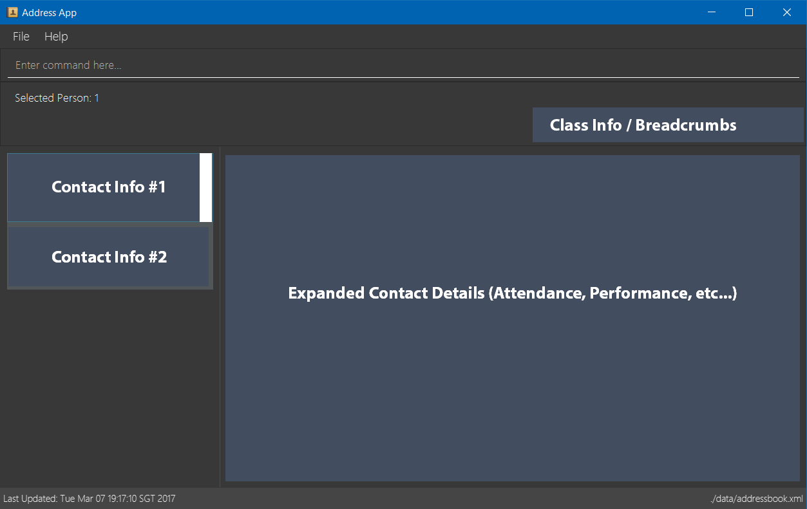

= ConTAct
ifdef::env-github,env-browser[:relfileprefix: docs/]

https://travis-ci.org/CS2103-AY1819S1-W13-3/main[image:https://travis-ci.org/se-edu/addressbook-level4.svg?branch=master[Build Status]]
https://coveralls.io/github/CS2103-AY1819S1-W13-3/main?branch=master[image:https://coveralls.io/repos/github/CS2103-AY1819S1-W13-3/main/badge.svg?branch=master[Coverage Status]]

ifdef::env-github[]

endif::[]

ifndef::env-github[]
image::images/Ui.png[width="600"]
endif::[]

* This is a student management system for teaching assistants. It has a GUI but most of the user interactions happen using a Command Line Interface.
* Teaching assistants who have trouble managing their student details, can use this to add, delete, find students. They can also use it to update attendance during each lesson and keep track of each students overall attendance.
* Also, this app also allows teaching assistants to keep track of their timetable and schedule classes and consultations easily, and even send out emails to all their students.

== Site Map

* <<UserGuide#, User Guide>>
* <<DeveloperGuide#, Developer Guide>>
* <<AboutUs#, About Us>>
* <<ContactUs#, Contact Us>>

== Acknowledgements

* Some parts of this sample application were inspired by the excellent http://code.makery.ch/library/javafx-8-tutorial/[Java FX tutorial] by
_Marco Jakob_.
* Libraries used: https://github.com/TestFX/TestFX[TextFX], https://bitbucket.org/controlsfx/controlsfx/[ControlsFX], https://github.com/FasterXML/jackson[Jackson], https://github.com/google/guava[Guava], https://github.com/junit-team/junit5[JUnit5]
* This project was built upon the Address Book sample application by se-edu: https://github.com/se-edu/addressbook-level4[se-edu/addressbook-level4].

== Licence : link:LICENSE[MIT]
